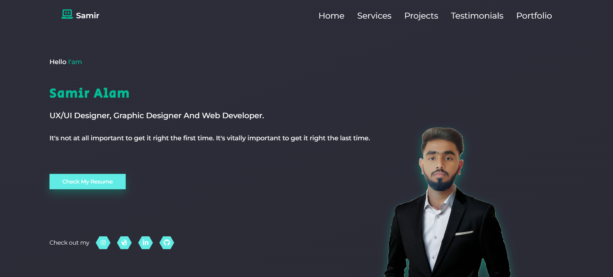

# ⚡ Samir Alam | Cyber-Minimalist Portfolio



> A futuristic, immersive developer portfolio featuring a "Hacker's Abyss" theme, interactive 3D elements, and a voice-reactive AI assistant.

🔗 **Live Demo:** [https://samiralam04.github.io/samir-portfolio/](https://samiralam04.github.io/samir-portfolio/)

## 🚀 Overview

This portfolio represents a complete reimagining of the personal developer site. Built with **React** and **Framer Motion**, it delivers a high-performance, visually striking experience. The core design philosophy revolves around a **Cyber-Minimalist Dark Theme**—combining sleek neon aesthetics with clean, functional UI.

## ✨ Key Features

- **🤖 Interactive AI Bot**: A fully animated, voice-reactive assistant that welcomes users, guides them through sections, and reacts to interactions (hover, click, poke).
- **🎨 Hacker's Abyss Theme**: A custom-designed dark UI with neon accents, glassmorphism effects, and terminal-inspired typography.
- **📊 Live Coding Stats**: Real-time integration with **GitHub** and **LeetCode** APIs to showcase coding activity and problem-solving stats.
- **🛹 Scroll-Driven Animations**: Smooth parallax effects and reveal animations powered by **Framer Motion** and **Intersection Observers**.
- **📱 Fully Responsive**: Optimized for all devices, from ultra-wide monitors to mobile screens, with adaptive layouts for the Bot and grids.
- **📫 Serverless Contact**: Integrated contact form for seamless communication without backend overhead.

## 🛠️ Tech Stack

### Core
- **React.js**: Frontend library for building the user interface.
- **Framer Motion**: For complex animations, transitions, and scroll effects.
- **Styled-Components**: For modular, dynamic CSS-in-JS styling.

### Visuals & 3D
- **Three.js / React Three Fiber**: For immersive 3D elements.
- **Lottie React**: For lightweight, high-quality vector animations (used for the Bot).
- **React Icons**: For consistent, scalable iconography.

### Data & Tools
- **GitHub API**: Fetching repositories and contribution data.
- **LeetCode API**: Displaying real-time problem-solving stats.
- **EmailJS / Formspree**: (Implied) For serverless form handling.

## 📦 Installation & Setup

1. **Clone the repository**
   ```bash
   git clone https://github.com/samiralam04/samir-portfolio.git
   cd samir-portfolio
   ```

2. **Install dependencies**
   ```bash
   npm install
   ```

3. **Run local server**
   ```bash
   npm start
   ```
   The app will open at `http://localhost:3000`.

## 🤖 The "Bot" Feature

The portfolio features a unique "Bot" component (`src/components/Bot/Bot.jsx`) that serves as a digital companion.
- **Voice Capabilities**: Uses the Web Speech API to greet users based on the time of day.
- **Context Awareness**: Reacts to scrolling, offering specific messages for "Projects", "Skills", etc.
- **Interactive**: Users can "poke" the bot (click) to trigger reactions, mute audio, or minimize the interface.
- **Dynamic Sizing**: Automatically adjusts its size and text bubble placement for perfect visibility on any screen size.

## 📄 License

This project is open source and available under the [MIT License](LICENSE).

---
Developed with 💙 and ☕ by **Samir Alam**
