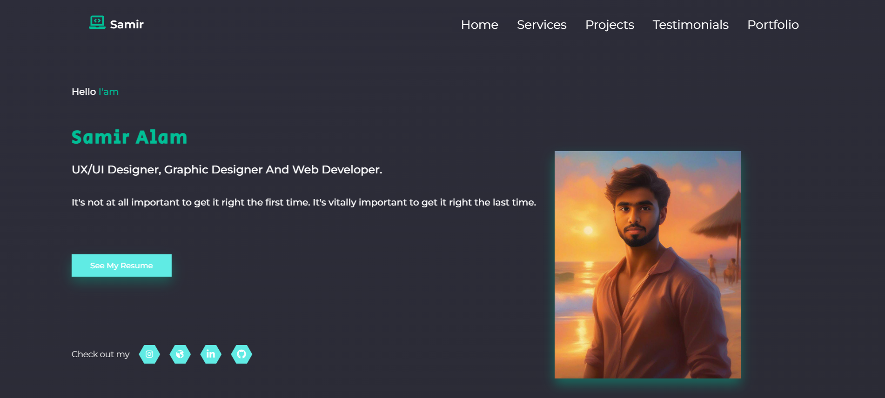

## Portfolio using React js and styled-components 2023

<<<<<<< HEAD

=======

>>>>>>> 958bf15d4ddac4ae402defc84712c385f453874b

## Demo
https://samiralam04.github.io/samir-portfolio/

## Features

- Animated navbar
- Slider
- Animation on scroll
- Responsive

## Description

This portfolio is build using React JS, Styled-Components and react awesome reveal library. People can see the owners services, projects, clients ideas and also has a serverless  contact form for people to get in touch with. 

Developed By Samir Alam .

## Technologies 

- [React JS](https://reactjs.org/docs/getting-started.html)
- [Styled-Components](https://styled-components.com)
- [React Slick](https://react-slick.neostack.com)
- [React Awesome Reveal](https://react-awesome-reveal.morello.dev/)
