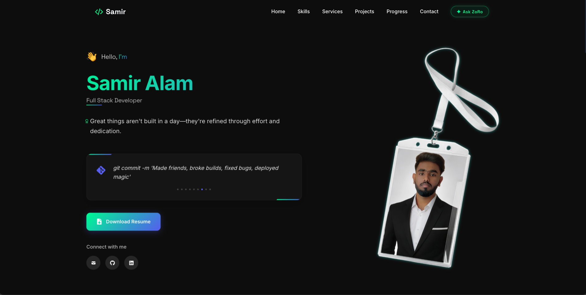

# ⚡ Samir Alam — Developer Portfolio & AI Assistant



> A futuristic, immersive developer portfolio built with a **Cyber-Minimalist Dark Theme**, real-time coding stats, animated project showcases, a scroll-driven interactive experience, and **"Meet My AI"** — an integrated conversational AI assistant powered by **Groq** and **Vercel Serverless Functions**.

🔗 **Live Demo:** [https://samir-portfolio-ai.vercel.app/](https://samir-portfolio-ai.vercel.app/)

---

## ⚖️ © Copyright & Usage

**Copyright © 2026 Samir Alam. All Rights Reserved.**

This repository and portfolio website represent the original work and intellectual property of **Samir Alam**.

- **Proprietary Assets**: The source code implementation, UI/UX design, Cyber-Minimalist styling, written case studies, project descriptions, AI prompts/knowledge architecture, and custom branding are proprietary.
- **Usage Restrictions**: Unauthorized copying, redistribution, modification, republishing, or presenting substantial portions of this portfolio as another person's work is strictly prohibited without prior written consent.
- **Personal & Evaluation Use**: Viewing this repository and public website for personal evaluation, review, and recruitment purposes is welcomed.
- For complete terms and licensing details, see [LICENSE](LICENSE) and [docs/COPYRIGHT.md](docs/COPYRIGHT.md).

---

## 🚀 Overview

This portfolio is a complete reimagining of the personal developer site — built entirely with **React 18**, **Framer Motion**, and **Styled Components**, backed by a serverless AI API running on **Groq Cloud**. It delivers a high-performance, visually striking experience centered around a **Cyber-Minimalist Dark Theme** with neon accents (`#00ff9d` green + `#6366f1` electric indigo), glassmorphism cards, interactive 3D elements, and real-time AI conversation.

---

## ✨ Key Features

- **🤖 "Meet My AI" Conversational Assistant** — Integrated AI assistant powered by **Groq** (`llama-3.3-70b-versatile` / `gpt-oss-20b`) via secure Vercel Serverless Functions. Handles project deep-dives, technical skill queries, education discussions, and natural conversation with strict anti-hallucination guardrails.
- **📱 Floating AI Widget for Mobile** — Bottom-left glassmorphic floating button with animated glowing icon badge for instant mobile access.
- **📌 Project-Specific AI Context** — Click **✦ Ask AI** on any project card to launch a focused discussion about that project's architecture, database design, and tech stack.
- **🎨 Cyber-Minimalist Dark Theme** — Custom CSS design system using CSS variables, glassmorphism, and neon gradients (green + indigo palette).
- **📊 Live Coding Stats** — Real-time integration with **GitHub API** and **LeetCode API** to fetch and display repos, contributions, and problem-solving stats.
- **🛹 Scroll-Driven Animations** — Smooth reveal animations powered by **Framer Motion** and **React Awesome Reveal** (Slide, Zoom, Fade).
- **📂 Project Carousel** — Interactive slider (react-slick) showcasing real-world projects with center-mode focus, float animation, and custom navigation arrows.
- **🧩 Tabbed Skills Section** — Animated tab switcher for Languages / Frameworks / Tools with hover glow effects on each skill card.
- **🏗️ Services Section** — Glassmorphism service cards for Frontend, Backend, and Clean Code offerings with hover lift effects.
- **📜 Scroll Progress Bar** — Fixed scroll-progress indicator at the top of the viewport.
- **📱 Fully Responsive** — Adaptive layouts for all screen sizes with locked 100dvh mobile drawers and sticky input controls.
- **🧭 Smooth Navigation** — Fixed glassmorphic navbar with scroll-aware background blur and anchor-based routing.

---

## 🛠️ Tech Stack

### 🧠 AI & Backend

| Technology                      | Purpose                                                       |
| ------------------------------- | ------------------------------------------------------------- |
| **Groq SDK**                    | Ultra-low latency LLM inference (`llama-3.3-70b-versatile`)   |
| **Vercel Serverless Functions** | Secure `/api/ask-ai` serverless endpoint with CORS protection |
| **Node.js**                     | Backend execution runtime                                     |

### ⚛️ Core Frontend

| Technology           | Version   | Purpose             |
| -------------------- | --------- | ------------------- |
| **React**            | `^18.2.0` | Frontend UI library |
| **React DOM**        | `^18.2.0` | DOM rendering       |
| **React Router DOM** | `^7.12.0` | Client-side routing |
| **React Scripts**    | `5.0.1`   | CRA build toolchain |

### 🎞️ Animation & Motion

| Technology               | Version    | Purpose                                                        |
| ------------------------ | ---------- | -------------------------------------------------------------- |
| **Framer Motion**        | `^12.23.6` | Complex animations, drawer transitions, and micro-interactions |
| **React Awesome Reveal** | `^4.3.1`   | Scroll-triggered reveals                                       |

### 🎨 Styling

| Technology            | Version    | Purpose                             |
| --------------------- | ---------- | ----------------------------------- |
| **Styled Components** | `^5.3.11`  | CSS-in-JS modular component styling |
| **@emotion/react**    | `^11.10.5` | Emotion CSS runtime                 |
| **Google Fonts**      | —          | Space Grotesk & Inter typography    |

### 🌐 3D & Visuals

| Technology                       | Version    | Purpose                         |
| -------------------------------- | ---------- | ------------------------------- |
| **Three.js**                     | `^0.179.1` | 3D rendering engine             |
| **@react-three/fiber**           | `^8.18.0`  | React renderer for Three.js     |
| **@react-three/drei**            | `^9.122.0` | Three.js helpers & abstractions |
| **three-mesh-bvh**               | `^0.7.8`   | BVH acceleration for 3D meshes  |
| **simplex-noise**                | `^3.0.1`   | Procedural noise generation     |
| **@lottiefiles/dotlottie-react** | `^0.17.10` | Lottie animation player         |

### 🧩 UI Components & Icons

| Technology                | Version   | Purpose                                                        |
| ------------------------- | --------- | -------------------------------------------------------------- |
| **React Icons**           | `^4.12.0` | Icon library (Fa, Si, Md, Fi, Tb, Bi, Ri, Cg, Io, Hi families) |
| **React Slick**           | `^0.29.0` | Carousel/slider for Projects section                           |
| **Slick Carousel**        | `^1.8.1`  | CSS for react-slick                                            |
| **React Tooltip**         | `^5.29.1` | Accessible tooltips                                            |
| **React Lazy Load Image** | `^1.6.3`  | Lazy image loading for performance                             |
| **React GitHub Calendar** | `^4.5.9`  | GitHub contribution calendar widget                            |

### 📡 Data & APIs

| Technology               | Purpose                                                            |
| ------------------------ | ------------------------------------------------------------------ |
| **GitHub REST API**      | Fetches repo count, stars, forks, followers, and contribution data |
| **LeetCode GraphQL API** | Fetches problem-solving stats (Easy / Medium / Hard counts)        |

---

## 📁 Project Structure

```
samir-portfolio/
├── api/                        # Vercel Serverless Backend
│   ├── ask-ai.js               # POST /api/ask-ai Groq AI handler
│   └── data/
│       └── portfolio.js        # Centralized verified portfolio knowledge
├── public/                     # Static assets
├── src/
│   ├── App.js                  # Root component & layout
│   ├── index.css               # Global CSS design system (variables, reset, fonts)
│   └── components/
│       ├── AI/                 # "Meet My AI" Feature Suite
│       │   ├── AIChat.jsx      # Slide-in chat drawer with message list
│       │   ├── AIContext.jsx   # Global AI state provider & message manager
│       │   ├── AIFloatingButton.jsx # Mobile bottom-left floating AI button
│       │   ├── AIInput.jsx     # Sticky message input with auto-focus
│       │   ├── AIMessage.jsx   # Formatted chat bubble component
│       │   ├── AISuggestions.jsx # Suggestion pill buttons
│       │   └── mockAI.js       # Hybrid API caller & smart offline fallback
│       ├── Banner/
│       │   ├── Header.jsx      # Fixed glassmorphic navbar with mobile menu
│       │   └── ProfComponent.jsx # Hero section with profile, social links, rotating quotes
│       ├── skills/
│       │   └── SkillsSection.jsx # Tabbed skills grid (Languages / Frameworks / Tools)
│       ├── Service/
│       │   ├── Services.jsx    # Service cards (Frontend, Backend, Clean Code)
│       │   └── Card.jsx        # Individual glass card component
│       ├── Projects/
│       │   ├── Projects.jsx    # Projects section wrapper
│       │   ├── Slider.jsx      # React-slick carousel with featured projects
│       │   └── Project.jsx     # Individual project card with "Ask AI" button
│       ├── progressGraph/
│       │   └── graph.jsx       # Live GitHub & LeetCode stats dashboard
│       ├── Footer/
│       │   └── Footer.jsx      # Contact links, social media, footer
│       └── common/
│           └── ScrollProgress.jsx # Scroll progress bar
├── vercel.json                 # Vercel routing & CORS configuration
├── package.json
└── README.md
```

---

## 🧑‍💻 Skills Showcased

### Languages

`Java` · `JavaScript` · `TypeScript` · `Python` · `C/C++` · `HTML5` · `CSS3` · `PHP`

### Frameworks & Libraries

`React.js` · `Next.js` · `FastAPI` · `PyTorch` · `MediaPipe` · `OpenCV` · `Node.js` · `Spring Boot` · `Tailwind CSS` · `Bootstrap 5` · `Flask` · `Express.js`

### Tools & Databases

`PostgreSQL` · `MongoDB` · `Git` · `Docker` · `Firebase` · `MySQL` · `Pandas` · `NumPy` · `Zustand` · `Recharts`

---

## 🗂️ Featured Projects

| Project                   | Category                        | Description                                                                                                                                                                                                   | Key Tech Stack                                                                   |
| ------------------------- | ------------------------------- | ------------------------------------------------------------------------------------------------------------------------------------------------------------------------------------------------------------- | -------------------------------------------------------------------------------- |
| **MindFlow**              | AI / Deep Learning              | Real-time physiological analytics platform tracking cognitive load, fatigue, and behavioral states at 30 FPS using deep temporal BiLSTM + Attention and OpenCV/MediaPipe with a React 19 telemetry dashboard. | Python, FastAPI, PyTorch, MediaPipe, OpenCV, React 19, Vite, Zustand, Recharts   |
| **SkyWings**              | Full Stack / Java & Spring Boot | Full-stack airline management & reservation system with smart flight search, passenger booking workflows, JWT authentication, role-based admin dashboard, and PostgreSQL.                                     | Java 17, Spring Boot 3, Spring Security, PostgreSQL, React 18, Tailwind CSS, JWT |
| **Product Data Explorer** | Full Stack / Data Engineering   | Full-stack web scraping and analytics platform with Playwright headless browser automation, background job processing, deduplication, and PostgreSQL storage.                                                 | Next.js, Playwright, PostgreSQL                                                  |
| **RollWise**              | Backend / Full Stack            | Student Attendance Management System featuring role-based access control (teachers & admins), automated attendance tracking, and report generation.                                                           | Java, Servlets, PostgreSQL                                                       |
| **AI Resume Chatbot**     | AI / LLM                        | Full-stack AI application that parses PDF resumes and enables recruiters to chat interactively with an LLM about candidate qualifications.                                                                    | AI/LLM, PDF parsing, Python                                                      |
| **Story Board**           | Frontend / Full Stack           | Storytelling platform with rich text editor, thumbnail uploads, real-time Firebase syncing, and direct browser-based PDF export.                                                                              | React, Firebase                                                                  |
| **Tiny URL**              | Backend / Full Stack            | URL shortening web application with user registration, authentication, HTTP session management, and PostgreSQL mapping.                                                                                       | Java, Servlets, PostgreSQL                                                       |
| **Real-Time Chat App**    | Frontend / Real-Time            | Real-time collaborative chat application with instant messaging via Firebase, photo uploads, and user blocking.                                                                                               | React.js, Firebase                                                               |

---

## 📦 Installation & Setup

### 1. Clone the repository

```bash
git clone https://github.com/samiralam04/samir-portfolio.git
cd samir-portfolio
```

### 2. Install dependencies

```bash
npm install
```

### 3. Configure Environment Variables

Create a `.env` file in the project root:

```env
# Backend (Secret — used by Vercel serverless function or local vercel dev)
GROQ_API_KEY=gsk_your_groq_api_key_here

# Frontend (Public URL to the backend API endpoint)
REACT_APP_AI_API_URL=http://localhost:3000/api/ask-ai
```

### 4. Run Locally

```bash
# Option A: React development server
npm start

# Option B: Full-stack with Vercel Serverless Functions
npx vercel dev
```

Open `http://localhost:3000` to view the application.

### 5. Build & Deploy

**Build production bundle:**

```bash
npm run build
```

**Deploy frontend to GitHub Pages:**

```bash
npm run deploy
```

**Deploy AI Backend to Vercel:**

1. Import the repository into [vercel.com](https://vercel.com).
2. Set `GROQ_API_KEY` in **Project Settings > Environment Variables**.
3. Deploy! Vercel automatically hosts `/api/ask-ai`.

---

## 🎨 Design System

```css
/* Color Palette */
--bg-dark:
  #0a0a0a /* Primary background */ --bg-surface: #121212
    /* Surface/card background */ --accent-primary: #00ff9d
    /* Neon Cyber-Green */ --accent-secondary: #6366f1 /* Electric Indigo */
    --accent-tertiary: #f472b6 /* Pink gradient accent */
    --text-primary: #f8fafc --text-muted: #64748b /* Typography */ Space Grotesk
    — headings,
  navbar, labels, AI badges Inter — body text, chat messages;
```

---

## 📄 License & Intellectual Property

This portfolio and its original codebase are **Proprietary and All Rights Reserved © 2026 Samir Alam**.
See [LICENSE](LICENSE) and [docs/COPYRIGHT.md](docs/COPYRIGHT.md) for full licensing terms and reuse policies.

### 📦 Third-Party Components

External libraries and dependencies (e.g., React, Framer Motion, Three.js, Styled Components, React Icons, Groq SDK) remain governed by their respective open-source licenses (MIT, Apache 2.0, BSD).

---

Developed with 💙 and ☕ by **Samir Alam**
